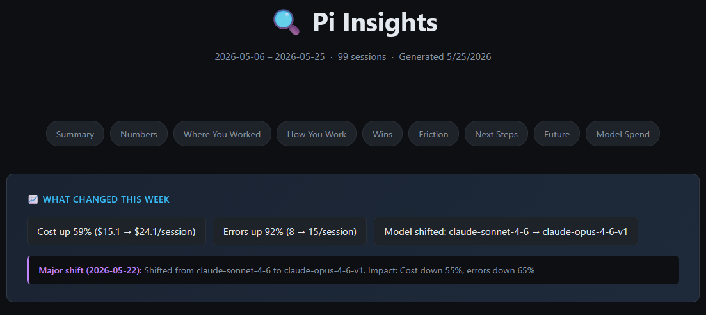
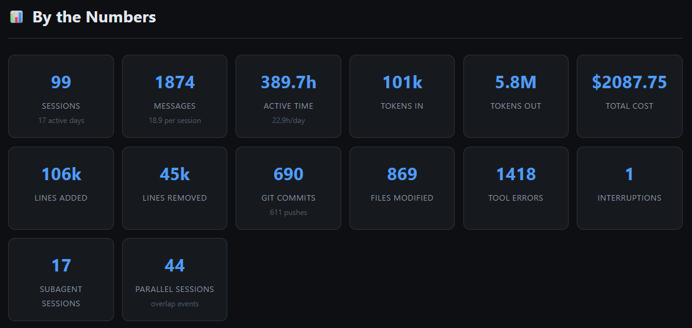
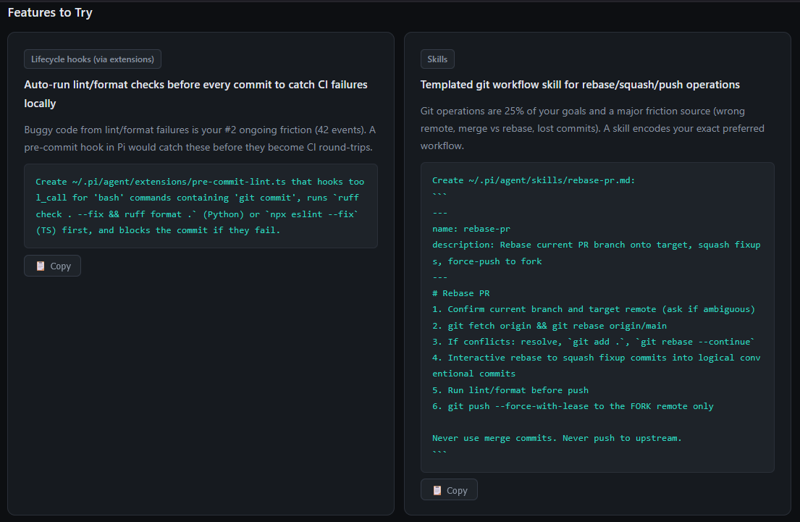
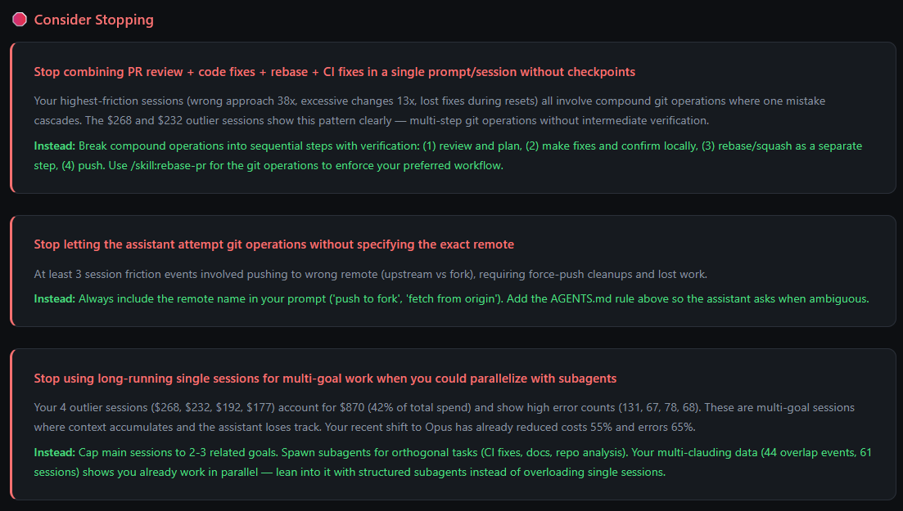
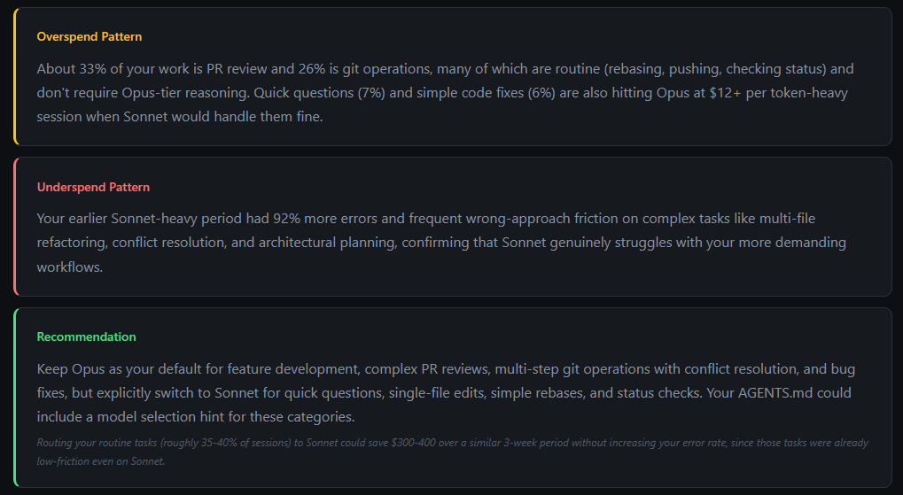

<!-- SPDX-FileCopyrightText: 2026 Hari Srinivasan <harisrini21@gmail.com> -->
<!-- SPDX-License-Identifier: AGPL-3.0-only -->



# Pi Insights

Personal usage analytics for the [Pi coding agent](https://github.com/earendil-works/pi). Scans your session history, extracts deterministic stats and LLM-powered facets, then generates a self-contained HTML report covering your workflows, friction points, and suggestions for improvement.

Built by the [Observal](https://github.com/BlazeUp-AI/Observal) team while developing our agent observability platform. We needed to understand how we actually use Pi across hundreds of sessions, what patterns emerge, and where we waste time or money. This extension is the result.

## Install

**From npm** (recommended):

```bash
pi install npm:@observal/pi-insights
```

**From source:**

```bash
git clone https://github.com/BlazeUp-AI/pi-insights.git
pi install ./pi-insights
```

**Try without installing:**

```bash
pi -e npm:@observal/pi-insights
```

## Usage

Run the command inside any Pi session:

```
/pi-insights
```

The report opens in your browser automatically.

### Flags

| Flag | Description |
|------|-------------|
| `--refresh` / `-r` | Invalidate all cached LLM facet extractions and re-run them |
| `--no-open` | Generate the report without opening it in the browser |
| `--since <N>d` | Only analyze sessions from the last N days (e.g. `--since 7d`) |
| `--md` | Output a Markdown report instead of opening the HTML version |

### Examples

```bash
# Normal run (uses caches, fast on re-runs)
/pi-insights

# Force re-extraction of all session facets
/pi-insights --refresh

# Generate without auto-opening
/pi-insights --no-open

# Only analyze the last 7 days
/pi-insights --since 7d

# Export as Markdown (for Slack, docs, etc.)
/pi-insights --md
```

## What the Report Shows

### Session stats at a glance

Tokens, cost, lines changed, commits, tool errors, parallel sessions, and more.



### Context-aware suggestions with copyable prompts

Suggests features, skills, and config additions tailored to your actual workflow. References your real projects and tools.



### "Stop Doing" section

Tells you what patterns are costing you time or money, with concrete alternatives.



### Model spend analysis

Identifies overspend (Opus on simple tasks) and underspend (Sonnet failing on complex work), with a recommendation and estimated savings.



## What Makes This Different

Most Pi insight extensions dump flat aggregates into an LLM prompt and get the same generic report every time. This one is temporal-aware:

- **Week-over-week diffs**: see what actually changed, not a static portrait
- **Decay-weighted charts**: recent sessions have more influence on friction/satisfaction/outcome charts (10-day half-life)
- **Trajectory detection**: are your costs/errors improving, worsening, or stable?
- **Anomaly detection**: spikes in cost or errors are surfaced with context
- **Resolved vs ongoing friction**: only surfaces problems you still have, not ones you fixed
- **Context-aware suggestions**: reads your existing AGENTS.md, installed skills, extensions, and packages. Will not suggest what you already have.
- **Negative suggestions**: tells you what to stop doing, not just what to add

## How It Works

The pipeline runs in five phases:

1. **Scan** all Pi session log files
2. **Extract stats** deterministically from each session (tool counts, tokens, languages, git activity, response times)
3. **LLM facet extraction** per session to classify goals, outcomes, satisfaction, and friction
4. **Aggregate with decay weighting**, compute diffs, detect anomalies and transitions, gather user context
5. **Generate insights** using 8 parallel LLM prompts (with temporal and user context injected) plus a synthesis prompt, then **render** a self-contained HTML report

Results are cached in `~/.pi/agent/usage-data/`:

| Path | Contents |
|------|----------|
| `session-meta/<id>.json` | Deterministic stats, cached permanently |
| `facets/<id>.json` | LLM-extracted facets, cached permanently (clear with `--refresh`) |
| `report.html` | Last generated report |
| `report.md` | Last markdown export (when using `--md`) |

## Requirements

- [Pi](https://github.com/earendil-works/pi) v0.74.0 or later
- An active model configured in Pi (used for both facet extraction and insight generation)

## License

AGPL-3.0-only
